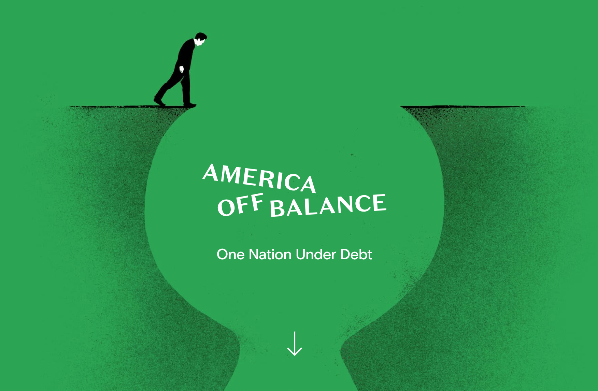

import { Appear, Notes, Image } from 'mdx-deck'
import { dark as darkTheme } from 'mdx-deck/themes'
import Syntax from './components/Syntax'
import theme from './theme'
import { Split } from 'mdx-deck/layouts'
import Hi from './components/Highlight'
import SVG from './components/SVG'
import AppearSplit from './components/AppearSplit'
import SplitCode from './components/SplitCode'
import vsDark from "./surfTheme";
import { CodeSurferColumnLayout, Step, Code } from "code-surfer";

export const themes = [darkTheme, Syntax, vsDark, theme]

import SplashScreen from 'components/SplashScreen'

<SplashScreen />

---

<Hi big><h1>Nicole Sullivan</h1></Hi>

## Product Manager @ Google (Chrome Team)

---

## Frontend frameworks like <Hi>React, Angular, & Vue</Hi>

## have become <Hi>standards</Hi> for web development

---

### Some of the biggest problems facing frameworks today:

# <Hi>Scheduling</Hi> & <Hi>Prioritization</Hi>

---

<Notes>
  The Chrome team has decided not to compete with frameworks, and instead work with them.
  The Chrome team is now meeting weekly with the React team to optimize Webkit for Chrome.
  This also benefits Edge.
</Notes>

### As a quick recap, browsers are:

<Hi big><h1>Single-threaded</h1></Hi>

---

import ThreadImg from './img/thread.js'

<Notes>This means that all operations have to compete for the main thread</Notes>

<ThreadImg style={{width: "34vw"}} />

---

---

import SingleThreadExample from './components/SingleThreadExample'

<Notes>
  When you have something like an instant search, and you want the typing to be fast, but it gets bogged down because the rest of the page is updating while the user is trying to type.
</Notes>

<SingleThreadExample />

---

<Notes>
  We want the call stack to look more like this. When the user types, that's a higher priority unit of work so we want it to to be inserted higher up in the call stack.
</Notes>

import PreferredStack from './components/PreferredStack'

<PreferredStack />

---

<Notes>
  The Chrome team is currently finalizing an API for to communicate optimization hints to the browser.
  These strategies will collectively be known as the scheduler.
</Notes>

<Hi big><h1>The Scheduler</h1></Hi>

---

<Notes>
  The current plan is to have 3 main levels of optimization.
</Notes>

<Appear>

<h1 style={{color: 'rgb(51, 203, 32)', fontSize: '7vw'}}>Low</h1>

<h1 style={{color: 'rgb(255, 145, 0)', fontSize: '7vw'}}>Medium</h1>

<h1 style={{color: 'rgb(241, 53, 35)', fontSize: '7vw'}}>High</h1>

</Appear>

---

<Hi big><h1>Mihai Cernusca</h1></Hi>

## Freelance Digital Product Designer and Developer

---

---

<Hi big><h1>Intersection Observer</h1></Hi>
<Hi big><h1>Scroll Event Listeners</h1></Hi>

---

import ScrollyTelling from './components/ScrollyTelling'

<ScrollyTelling />
