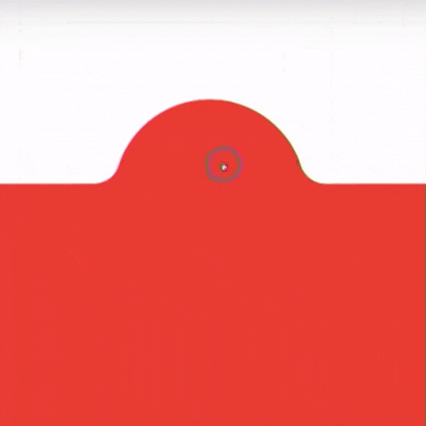
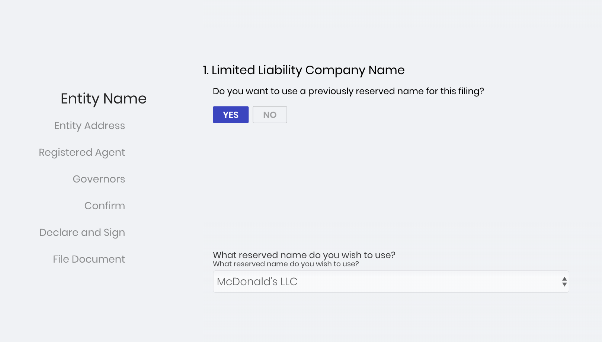

import { Appear, Notes, Image } from 'mdx-deck'
import { dark as darkTheme } from 'mdx-deck/themes'
import Syntax from './components/Syntax'
import theme from './theme'
import { Split } from 'mdx-deck/layouts'
import Hi from './components/Highlight'
import SVG from './components/SVG'
import AppearSplit from './components/AppearSplit'
import SplitCode from './components/SplitCode'
import vsDark from "./surfTheme";
import { CodeSurferColumnLayout, Step, Code } from "code-surfer";

export const themes = [darkTheme, Syntax, vsDark, theme]

import SplashScreen from 'components/SplashScreen'

<SplashScreen />

<Notes>
  Jon asked me to recap what I learned at React Rally this year. And in preparing for this lunch and learn I decided that a summary probably wouldn't be very helpful or interesting so I've decided to focus on just a few talks, and other things that I learned will be incorporated into future lunch and learns.
</Notes>

---

<Hi big><h1>Nicole Sullivan</h1></Hi>

## Product Manager @ Google (Chrome Team)

---

<Notes>
  The Chrome team has decided not to compete with frameworks, and instead work with them.
  The Chrome team is now meeting weekly with the React team to optimize Webkit for Chrome.
  This also benefits Edge.
</Notes>

## Frontend frameworks like <Hi>React, Angular, & Vue</Hi>

## have become <Hi>standards</Hi> for web development

---

### Some of the biggest problems facing frameworks today:

# <Hi>Scheduling</Hi> & <Hi>Prioritization</Hi>

---

<iframe width="1800" height="900" src="https://www.youtube.com/embed/nLF0n9SACd4?start=188" frameborder="0" allow="accelerometer; autoplay; encrypted-media; gyroscope; picture-in-picture" allowfullscreen></iframe>

---

### As a quick recap, browsers are:

<Hi big><h1>Single-threaded</h1></Hi>

---

import ThreadImg from './img/thread.js'

<Notes>This means that all operations have to compete for the main thread</Notes>

<ThreadImg style={{width: "34vw"}} />

---


---

import SingleThreadExample from './components/SingleThreadExample'

<Notes>
  When you have something like an instant search, and you want the typing to be fast, but it gets bogged down because the rest of the page is updating while the user is trying to type.
</Notes>

<SingleThreadExample />

---

<Notes>
  We want the call stack to look more like this. When the user types, that's a higher priority unit of work so we want it to to be inserted higher up in the call stack.
</Notes>

import PreferredStack from './components/PreferredStack'

<PreferredStack />

---

<Notes>
  The Chrome team is currently finalizing an API for to communicate optimization hints to the browser.
  These strategies will collectively be known as the scheduler.
</Notes>

<Hi big><h1>The Scheduler</h1></Hi>

---

<Notes>
  The current plan is to have 3 main levels of optimization.
</Notes>

<Appear>

<h1 style={{color: 'rgb(51, 203, 32)', fontSize: '7vw'}}>Low</h1>

<h1 style={{color: 'rgb(255, 145, 0)', fontSize: '7vw'}}>Medium</h1>

<h1 style={{color: 'rgb(241, 53, 35)', fontSize: '7vw'}}>High</h1>

</Appear>

---

<Hi big><h1>Mihai Cernusca</h1></Hi>

## Freelance Digital Product Designer and Developer

---

<a href="https://americaoffbalance.org/" target="\_blank">
  
</a>

---

<Notes>
  Mihai also shows how he creates these complex geometric shapes with chamfered edges in realtime. Very impressive.
</Notes>



---

<Hi big><h1>Scrollytelling</h1></Hi>

---

<Hi big><h1>Intersection Observer</h1></Hi>
<Hi big><h1>Scroll Event Listeners</h1></Hi>

---

# usePageProgress()

---


---

```jsx
import {usePageProgress} from 'crooks'

const progress = usePageProgress();
```

---

import Scrollytelling from './components/Scrollytelling'

<Scrollytelling />

---

<Scrollytelling debug />

---

<Notes>
  This also has more practical uses. In fact, riverguide is using these techniques right now.
</Notes>

<a href="https://riverguide.netlify.com/" target="\_blank">
  
</a>

---

<Notes>
  He ends by talking about this concept called Visual Scaffolding Tools which I think is great. I'll let him tell you about it.
</Notes>

<iframe width="1800" height="900" src="https://www.youtube.com/embed/CqQX_pIAJug?start=1175" frameborder="0" allow="accelerometer; autoplay; encrypted-media; gyroscope; picture-in-picture" allowfullscreen></iframe>

---

# "<Hi>Tools</Hi>, and <Hi>the kind of tools</Hi> you use as designers, as developers, as product owners, <Hi>make a big impact</Hi> on the kind of challenges you can take on."

### - James Haliburton

---

<Notes>
  I think this concept is really true. And we need to build more of our own tools to create things faster and more creatively.
  As I was thinking about this, I realized this is something we probably do subconsciously. I went through and listed some of the tools I've created in the past.
  None of these tools are open-sourced or even all that well-built if we're being honest, but I think they fit the definition of "scaffolding" tools. They have all improved my work.
</Notes>

### - Node script to convert SVG icons into React components
### - CLI for backup/restore of Wizard form definitions
### - Chrome Devtools extension for debugging wizards
### - Online tool to calculate the difference between two times
### - Embedded sandbox for testing SOS frontend components

---

<Appear>

# Cheap

# Modular

# Temporary

</Appear>

---

# <Hi>Don't overthink</Hi> every solution.

<hr/>

# Build <Hi>your own</Hi> tools

---

<Hi big><h1>Challenge</h1></Hi>

---

# Look at a process you're involved in:

---

## Design <br/>Customer Communications <br/>Database management <br/>Testing <br/>Development <br/>Etc

---

## build yourself a <Hi>quick tool</Hi> to improve your work

## Excel sheet<br/>Node script<br/>Template for a program you use<br/><Hi>¯\\\_(ツ)\_/¯</Hi>

---

## And if you're proud of it <Hi>share it</Hi> on Slack.

<Hi big><h1>Thanks!</h1></Hi>
